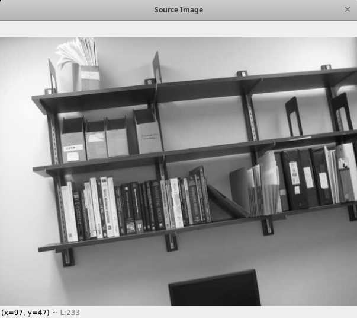
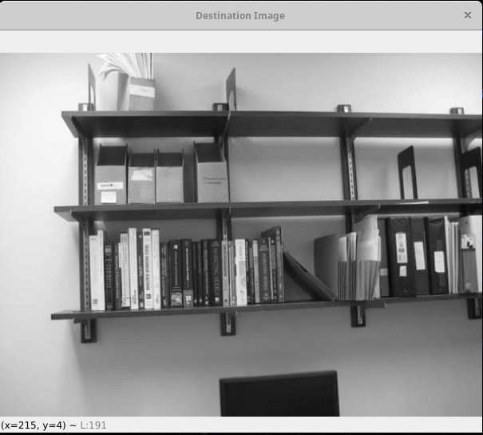
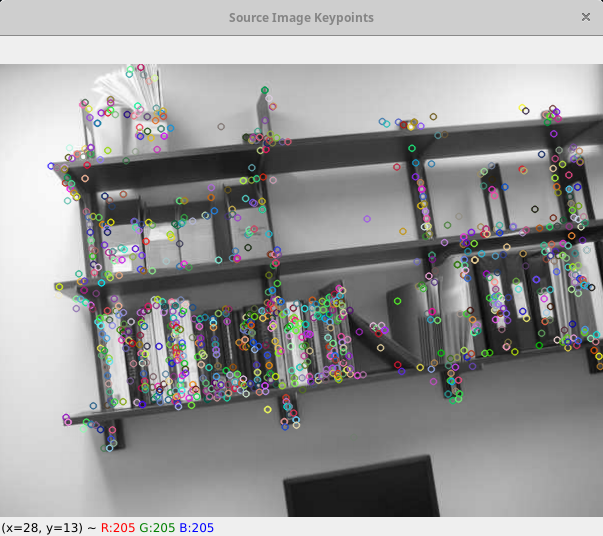
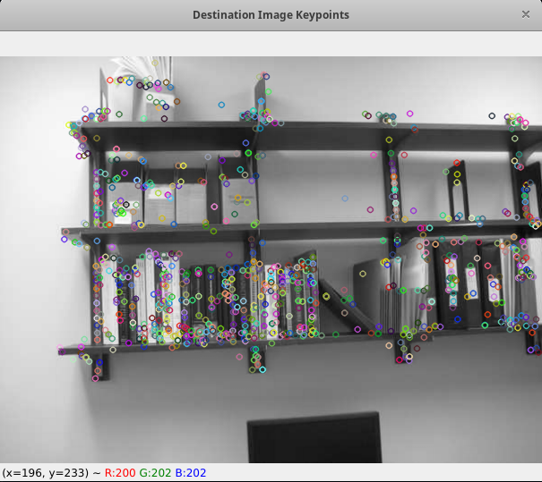
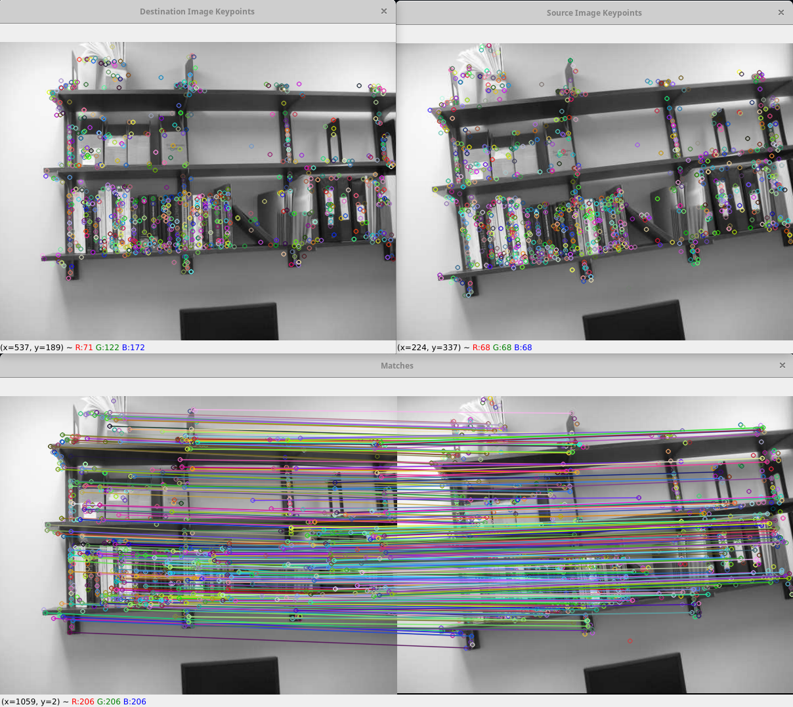
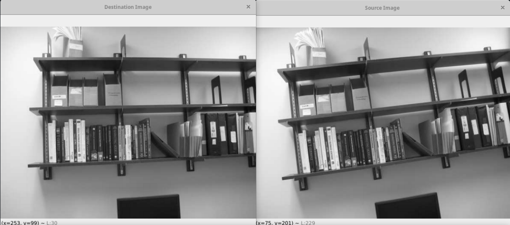
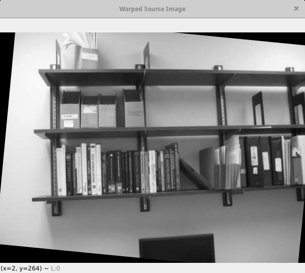

# Folder Content

In this folder you can see python and C++ implementation of this project while using OpenCV library.

# Quick Recap

We are given 2 images. Both images have the same object in them, while the objects are rotated differently. 

This image is our `source image` that we will transform using `homography` such that the object in the images overlap.

This is our `destination image` that we are using as a reference for warping the `source image`.

We can notice a slight difference in the angle of the object in the image. 

# Spep 1 (SIFT)

First, we use `SIFT algorithm` to find corresponding keypoints on both images.

Source image keypoints:

Destination image keypoints:

We can see that those keypoints match in the image below. To macth those keypoints, we used FLANN based Matcher. FLANN stands for Fast Library for Approximate Nearest Neighbors. It contains a collection of algorithms optimized for fast nearest neighbor search in large datasets and for high dimensional features. For FLANN based matcher, we need to pass two dictionaries which specifies the algorithm to be used, its related parameters etc. First one is IndexParams. For various algorithms, the information to be passed is explained in FLANN docs. 

        index_params = dict(algorithm = 0, trees = 5)
        
Second dictionary is the SearchParams. It specifies the number of times the trees in the index should be recursively traversed. Higher values gives better precision, but also takes more time. 

        search_params = dict()
        
Finally we pass those as arguments to FLANN based matcher and find the matches:

        flann_algorithm = cv2.FlannBasedMatcher(index_params, search_params)
        matches = flann_algorithm.knnMatch(descriptors_correct_image, descriptors_incorrect_image, k=2)
        
We then find good matches. Good in this case we represent when distance between the 2 points is less than 0.5 * 

It is very possible that there are some missmatches. That will be resolved in the next step with `RANSAC algorithm`.

# Step 2 (Homography with RANSAC)

Use FindHomography() to find the homography between the images while using `RANSAC algorithm` to remove outliers.

    homography_matrix, mask = cv2.findHomography(train_pts, query_pts, cv2.RANSAC, 5.0)
    
# Step 3 

# Warp source image to destination based on homography

    im_out = cv2.warpPerspective(incorrect_img, homography_matrix, (correct_img.shape[1],correct_img.shape[0]))
    
# RESULTS

### Input

### Output

